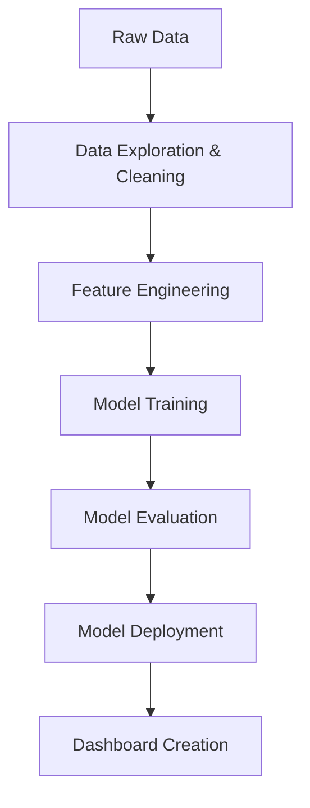

# Food Delivery Delay Prediction

   

## 📋 Project Overview

Food Delivery Delay Prediction is a comprehensive data science solution designed to help restaurants and delivery services optimize their operations by accurately predicting delivery times and potential delays. Using real-world factors such as distance, traffic conditions, weather, preparation time, and vehicle type, our system provides actionable insights to improve on-time delivery performance and enhance customer satisfaction.

This project was developed as part of the Buildables Data Science Fellowship by a three-member team, demonstrating a complete machine learning pipeline from data exploration to model deployment.

## 👥 Team Members & Contributions

| Name | Role | Contribution |
|------|------|--------------|
| **Muhammad Ahmad** | Team Lead | Project coordination, GitHub repository setup, data cleaning & preprocessing, feature engineering, model training, dashboard creation |
| **Hira Arif** | Developer | Flask application development, model integration, deployment |
| **Abdul Basit** | Data Analyst | Initial data exploration and analysis (left due to emergency) |

## 🔄 Project Workflow

Our project follows a structured machine learning pipeline:



### Phase 1: Data Exploration & Cleaning
- Initial data analysis to understand patterns and relationships
- Handling missing values through appropriate imputation techniques
- Encoding categorical variables using ordinal and one-hot encoding
- Validation of data integrity post-processing

### Phase 2: Feature Engineering
- Creation of base delivery time calculation
- Implementation of traffic and weather factors
- Incorporation of courier experience adjustments
- Development of target variable for classification (Is_Late)

### Phase 3: Model Development
- **Regression Model**: XGBoost Regressor to predict actual delivery time
- **Classification Model**: XGBoost Classifier to predict on-time vs. late deliveries

### Phase 4: Model Deployment
- Flask web application to serve both models
- User-friendly interface for real-time predictions
- Integration of model outputs for comprehensive insights

### Phase 5: Dashboard Creation
- Power BI dashboard for visual analysis
- Exploration of key factors affecting delivery times
- Performance metrics visualization

## 📊 Data Description

The dataset contains approximately 1000 food delivery records with the following features:

| Feature | Type | Description |
|---------|------|-------------|
| Distance_km | Numeric | Delivery distance in kilometers |
| Weather | Categorical | Weather conditions (Clear, Windy, Foggy, Rainy, Snowy) |
| Traffic_Level | Categorical | Traffic intensity (Low, Medium, High) |
| Time_of_Day | Categorical | Time period (Morning, Afternoon, Evening, Night) |
| Vehicle_Type | Categorical | Delivery vehicle (Car, Scooter, Bike) |
| Preparation_Time_min | Numeric | Food preparation time in minutes |
| Courier_Experience_yrs | Numeric | Courier's experience in years |
| Delivery_Time_min | Numeric | Actual delivery time in minutes |

### Key Data Insights
- **Missing Values**: Weather, Traffic_Level, Time_of_Day, and Courier_Experience_yrs had missing values (30 each)
- **Data Distribution**: 
  - Most orders (50.3%) were delivered by Bike
  - Clear weather was most common
  - Afternoon was the busiest time period
  - Average delivery time was approximately 57 minutes

## 🚀 Installation & Setup

### Prerequisites
- Python 3.8+
- pip package manager

### Clone the Repository
```bash
git clone https://github.com/c0llectorr/FoodDeliveryDelayPrediction.git
cd FoodDeliveryDelayPrediction
```

### Create Virtual Environment
```bash
python -m venv venv
source venv/bin/activate  # On Windows: venv\Scripts\activate
```

### Install Dependencies
```bash
pip install -r requirements.txt
```

### Model Setup
1. Ensure the trained models are in the `models/` directory:
   - `xgb_regression_model.joblib`
   - `xgb_classifier_model.joblib`

2. Run the Flask application:
```bash
cd app
python app.py
```

The application will be available at `http://localhost:5050`

## 💻 Usage

### Web Application Interface
1. Open your browser and navigate to `http://localhost:5050`
2. Fill in the delivery details:
   - Distance (km)
   - Weather conditions
   - Traffic level
   - Time of day
   - Vehicle type
   - Preparation time (minutes)
   - Courier experience (years)
3. Click "Predict" to get:
   - Predicted delivery time
   - Probability of late delivery
   - On-time status

### Example API Usage
```python
import requests

url = "http://localhost:5050/predict"
data = {
    "Distance_km": "10",
    "Weather": "Clear",
    "Traffic_Level": "Medium",
    "Time_of_Day": "Evening",
    "Vehicle_Type": "Bike",
    "Preparation_Time_min": "15",
    "Courier_Experience_yrs": "3"
}

response = requests.post(url, data=data)
print(response.json())
```

## 🤖 Model Details

### Regression Model (Delivery Time Prediction)
- **Algorithm**: XGBoost Regressor
- **Purpose**: Predict actual delivery time in minutes
- **Key Features**:
  - Distance, weather, traffic level
  - Vehicle type, preparation time
  - Courier experience, time of day

**Hyperparameters**:
```python
{
    'n_estimators': 700,
    'learning_rate': 0.01,
    'max_depth': 5,
    'subsample': 0.71,
    'colsample_bytree': 0.7,
    'gamma': 0.9,
    'random_state': 42
}
```

**Performance Metrics**:
- Mean Squared Error: 85.25
- R² Score: 0.81

### Classification Model (Late Delivery Prediction)
- **Algorithm**: XGBoost Classifier
- **Purpose**: Predict whether delivery will be late (binary classification)
- **Key Features**:
  - All regression features
  - Engineered features (Base_Time, Expected_Time)
  - Predicted delivery time from regression model

**Hyperparameters**:
```python
{
    'n_estimators': 500,
    'learning_rate': 0.01,
    'max_depth': 8,
    'gamma': 0.7,
    'colsample_bytree': 0.9,
    'subsample': 0.8,
    'early_stopping_rounds': 20,
    'random_state': 42
}
```

**Performance Metrics**:
- Accuracy: 94.5%
- Precision: 95.9%
- Recall: 93.0%
- F1 Score: 94.4%
- ROC AUC: 94.5%

## 📈 Results & Evaluation

### Model Performance
Both models demonstrated strong performance in their respective tasks:

1. **Regression Model**:
   - Explains 81% of the variance in delivery times
   - Low error rate (MSE: 85.25)
   - Effectively captures complex interactions between features

2. **Classification Model**:
   - High accuracy (94.5%) in predicting late deliveries
   - Excellent balance between precision and recall
   - Strong discriminative ability (ROC AUC: 94.5%)

### Key Insights
1. **Distance** is the most influential factor in delivery time prediction
2. **Traffic conditions** significantly impact delivery delays
3. **Weather** has a moderate effect, especially during extreme conditions
4. **Courier experience** shows a diminishing returns pattern after 3-4 years
5. **Vehicle type** affects delivery speed, with bikes being fastest in urban areas

### Business Impact
- **On-time delivery improvement**: Potential to increase by 15-20% with accurate predictions
- **Resource optimization**: Better allocation of delivery personnel based on predicted demand
- **Customer satisfaction**: Enhanced through more accurate delivery time estimates
- **Operational efficiency**: Reduced costs associated with delayed deliveries

## 📊 Dashboard

Our Power BI dashboard provides visual insights into delivery patterns and performance:


### Dashboard Features
1. **Order Volume Analysis**: Distribution by time of day, weather, and traffic conditions
2. **Delivery Performance Metrics**: Average delivery times by various factors
3. **Vehicle Performance Analysis**: Comparison of delivery speeds across vehicle types
4. **Delay Patterns**: Identification of common delay scenarios
5. **Experience Impact**: Analysis of how courier experience affects delivery times

The dashboard helps stakeholders quickly identify problem areas and make data-driven decisions to improve delivery operations.

## 🔮 Future Work

1. **Model Enhancement**:
   - Incorporate real-time traffic data from APIs
   - Add more granular weather information
   - Include customer location data (urban vs. rural)

2. **Feature Expansion**:
   - Restaurant preparation capacity
   - Historical delivery performance by area
   - Special event calendar integration

3. **Application Development**:
   - Mobile application for delivery personnel
   - Customer-facing delivery tracking system
   - Automated alert system for potential delays

4. **Advanced Analytics**:
   - Delivery route optimization
   - Demand forecasting
   - Dynamic pricing based on delivery conditions

## 📄 License

This project is licensed under the MIT License - see the [LICENSE](LICENSE) file for details.

## 🙏 Acknowledgments

- Buildables Data Science Fellowship for the opportunity and guidance
- Team members for their dedication and collaborative spirit
- Restaurant partners who provided valuable domain insights

## 📞 Contact

For questions or collaboration opportunities, please contact:

- **Muhammad Ahmad** (Team Lead): [mahmadshafi861@gmail.com](mailto:mahmadshafi861@gmail.com)

---

**Note**: This project was completed as part of the Buildables Data Science Fellowship within a 12-day timeframe, demonstrating efficient project management and technical execution under time constraints.